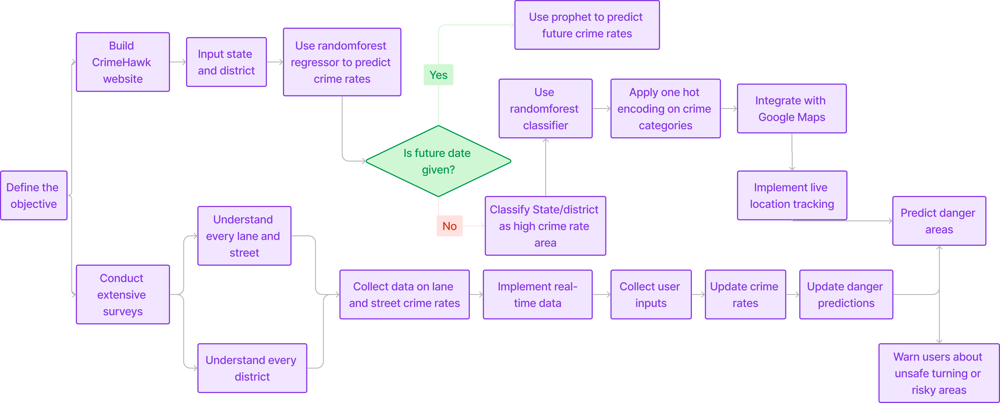

# CrimeHawk
An end-to-end application for crime rate detection and crime type classification

## Problem Statement
Despite the abundance of crime data, translating this information into actionable insights remains a significant challenge. Users often struggle to find relevant and up-to date crime statistics for specific states and districts.  Moreover, predicting future crime trends involves complex analysis and modelling, which is typically beyond the reach of ordinary users. Existing platforms that offer crime data  often lack predictive capabilities or fail to provide a simple way to classify regions based on crime rates. This creates a gap in the ability of citizens and law enforcement to assess current safety levels, anticipate future crime risks, and take appropriate measures. Without reliable predictions and clear classification of high-crime areas, it becomes difficult to allocate resources effectively and ensure public safety. "CrimeHawk" addresses this problem by offering a comprehensive solution for crime rate analysis, prediction, and classification, all through a user-friendly web interface. The platform aims to improve public safety and support law enforcement efforts by providing accurate crime data and reliable predictions.

## Architecture/Website Overview 

## How to use the repository